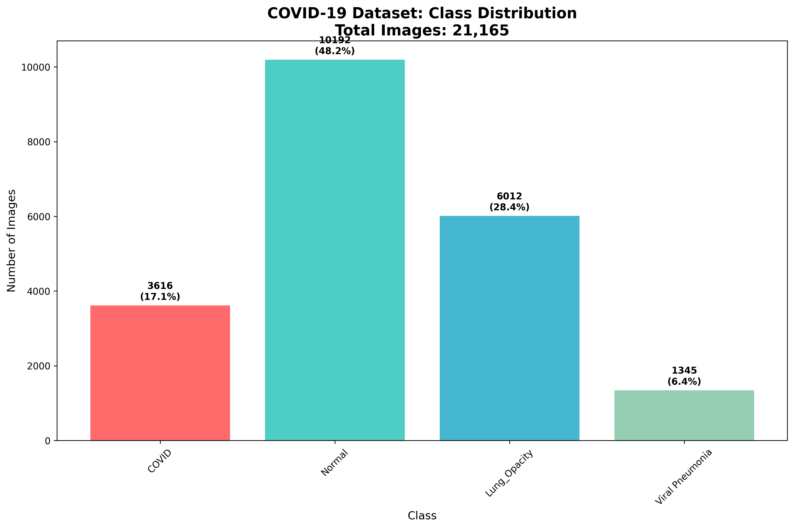
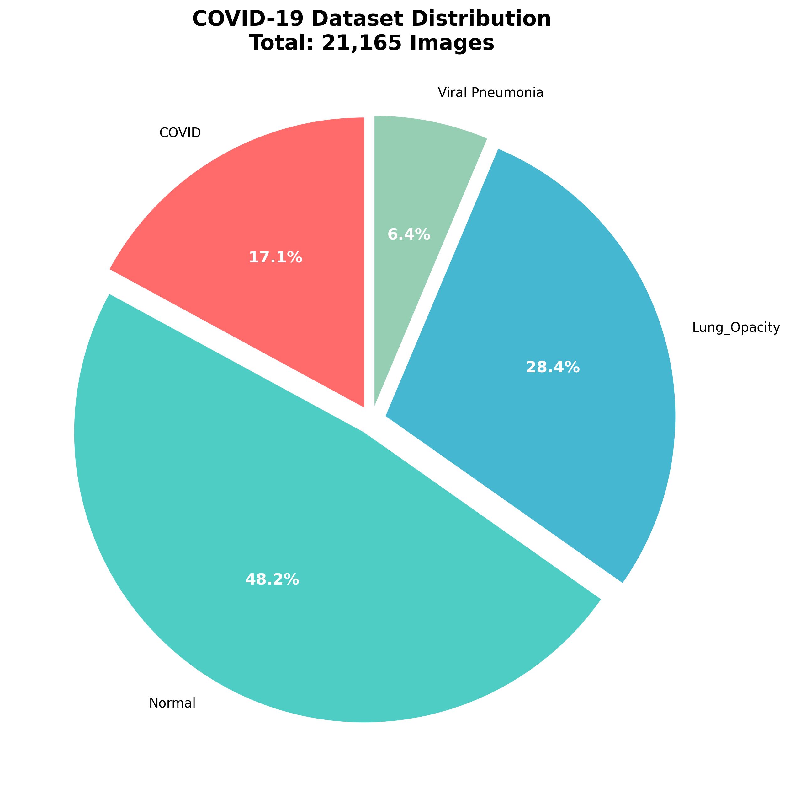
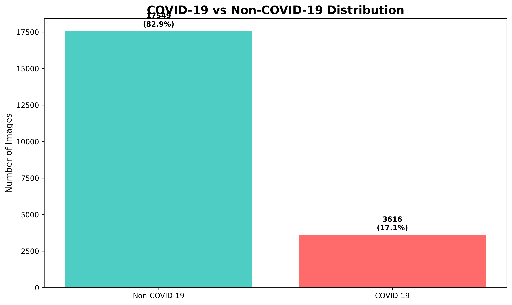
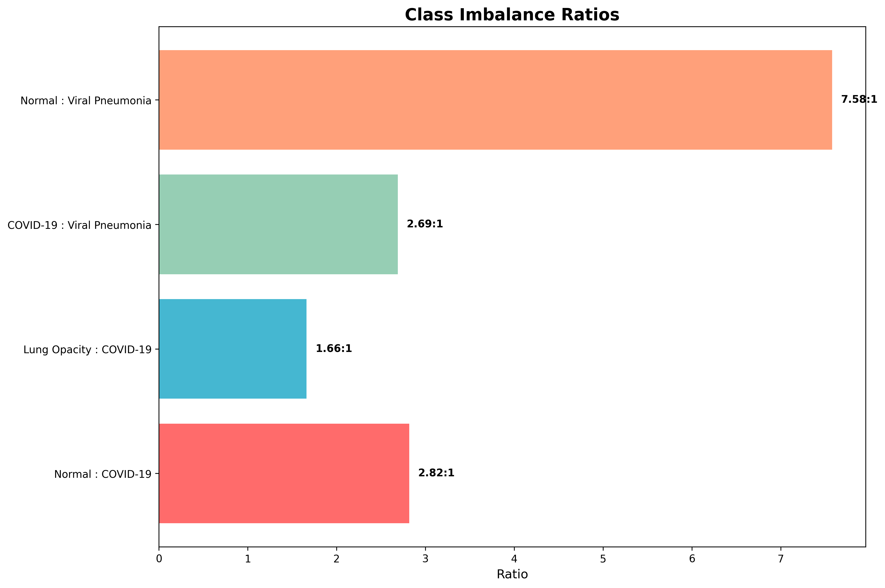
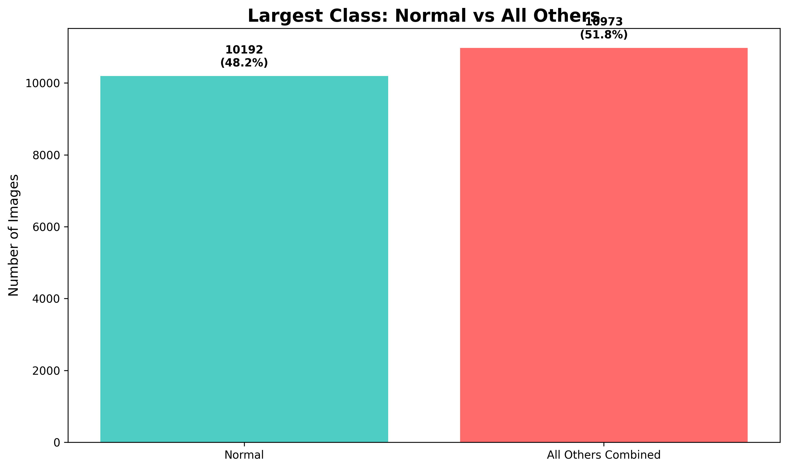
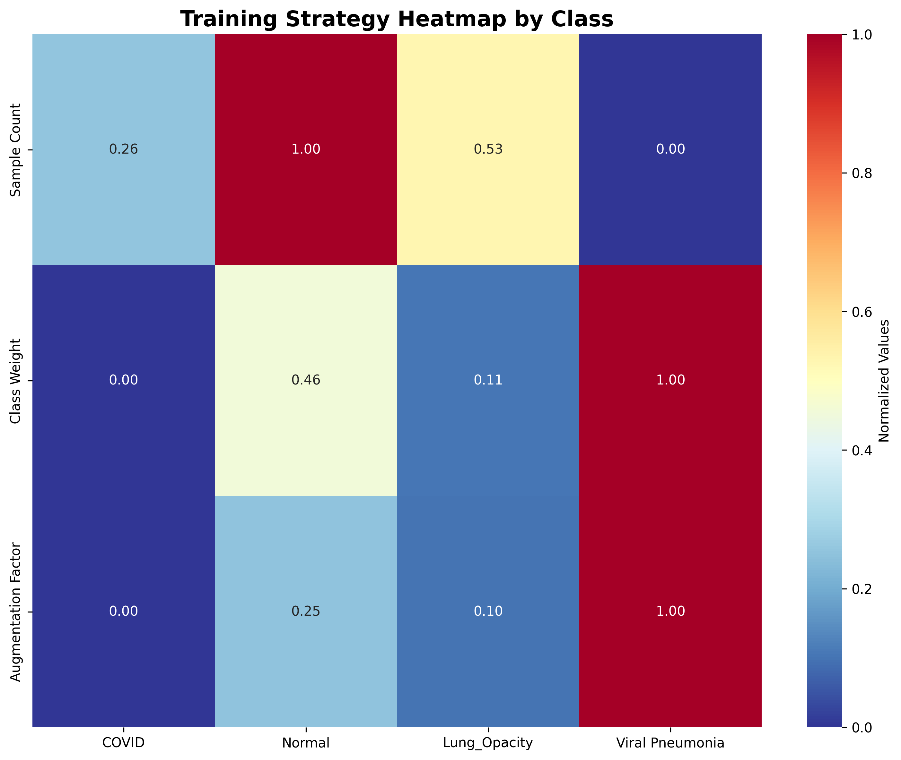
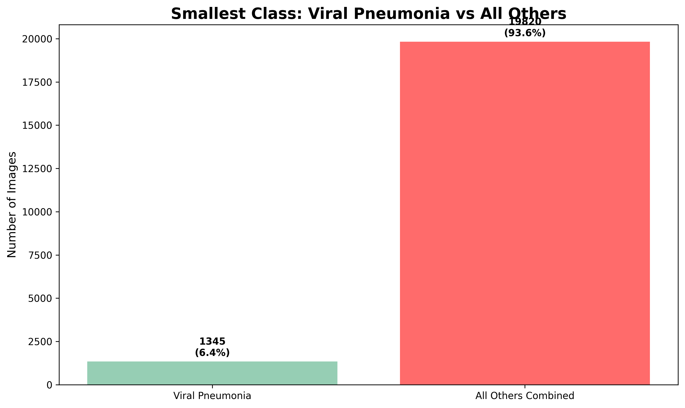
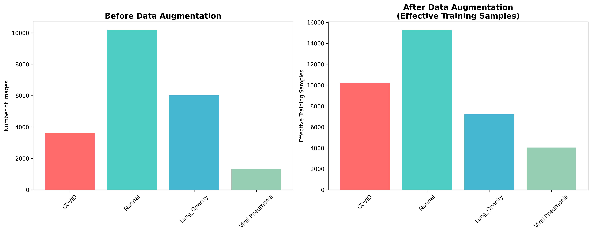
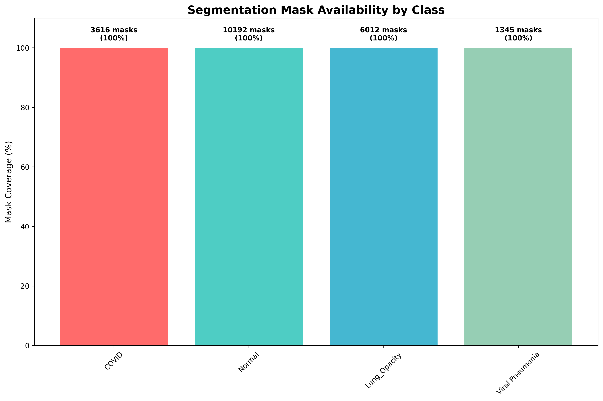
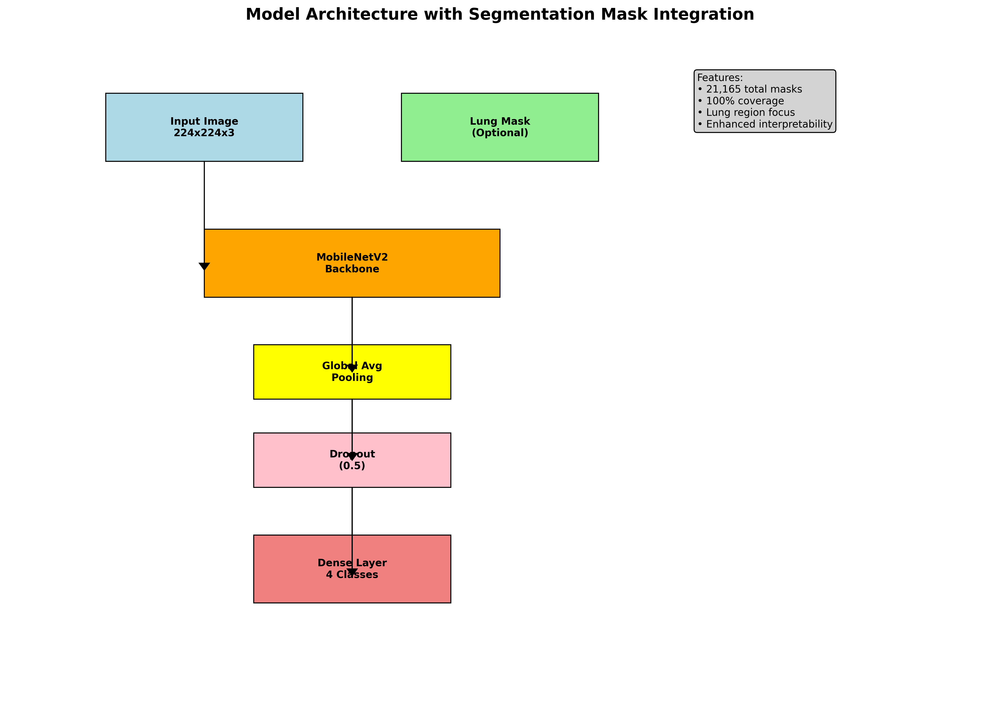

# COVID-19 Chest X-Ray Classification Project
### async-final-project-red-Vishal

## Dataset
[COVID-19 Radiography Database](https://www.kaggle.com/datasets/tawsifurrahman/covid19-radiography-database)

## Why I Chose This Dataset

I selected the COVID-19 Radiography Database for several compelling reasons:

1. **Medical Relevance**: The dataset addresses a critical healthcare challenge - rapid and accurate COVID-19 diagnosis using chest X-rays
2. **Comprehensive Coverage**: With 21,165 images across 4 classes, it provides substantial data for robust machine learning model training
3. **Real-world Impact**: Developing accurate diagnostic tools can assist healthcare professionals in pandemic response
4. **Technical Challenge**: The dataset presents interesting class imbalance and multi-class classification challenges
5. **Segmentation Capabilities**: Includes lung masks for advanced analysis and model interpretability

---

## COVID-19 Radiography Database — Summary Insights

### 1. Total Images Distribution

**Dataset Composition:**
- **COVID-19 Positive:** 3,616 images
- **Normal:** 10,192 images  
- **Lung Opacity:** 6,012 images
- **Viral Pneumonia:** 1,345 images  
- **Total:** **21,165 chest X-ray images**

#### Diagram 1: Class Distribution Bar Chart


#### Diagram 2: Class Distribution Pie Chart


---

### 2. COVID-19 Proportion Analysis

COVID-19 positive cases make up **~17.1%** of the dataset, representing a significant minority class that requires careful handling during model training.

#### Diagram 1: COVID-19 vs Non-COVID-19 Distribution


#### Diagram 2: Class Imbalance Ratio Visualization


---

### 3. Largest Class Analysis

The **Normal** class is the largest, containing 10,192 images (~48.2% of the dataset), which creates a significant class imbalance challenge.

#### Diagram 1: Normal Class Dominance


#### Diagram 2: Impact on Model Training


---

### 4. Smallest Class Analysis

The **Viral Pneumonia** class is the smallest, with 1,345 images (~6.4% of the dataset), presenting the greatest challenge for model generalization.

#### Diagram 1: Minority Class Challenge


#### Diagram 2: Data Augmentation Strategy


---

### 5. Segmentation Masks Analysis

All 3,616 COVID-19 positive cases have corresponding lung masks, along with masks for other classes, making this one of the largest annotated lung mask datasets available.

#### Diagram 1: Mask Availability by Class


#### Diagram 2: Mask Utilization in Model Architecture


---

### 6. Sources of COVID-19 Images

COVID-19 images come from multiple sources, ensuring diversity and robustness:

1. **Padchest dataset** — 2,473 images (68.4%)
2. **German medical school** — 183 images (5.1%)
3. **SIRM, GitHub, Kaggle & Twitter** — 559 images (15.5%)
4. **Another GitHub source** — 400 images (11.1%)
5. **Images from 43 different publications**

---

### 7. Image Format & Resolution

- **Format:** PNG (lossless compression)
- **Original Resolution:** 299×299 pixels
- **Model Input Resolution:** 224×224 pixels (resized for MobileNetV2)
- **Color Channels:** Grayscale converted to 3-channel RGB

---

### 8. Source of Most Normal Images

The **RSNA** dataset contributed **8,851** of the 10,192 Normal images (~86.9%), providing a consistent baseline for healthy lung X-rays.

---

### 9. Source of Lung Opacity Images

All **6,012** Lung Opacity images come from the RSNA CXR dataset, ensuring consistency in imaging protocols and quality standards.

---

### 10. Dataset Objective

The dataset is designed to enable researchers to develop impactful work on COVID-19 detection using chest X-rays, supporting pandemic response and diagnostic model improvement.

---

## Model Architecture & Training

### Transfer Learning Approach
- **Base Model:** MobileNetV2 (pre-trained on ImageNet)
- **Custom Head:** Global Average Pooling + Dropout (0.5) + Dense (4 classes)
- **Loss Function:** Focal Loss (γ=2.0, α=0.25) for handling class imbalance
- **Optimizer:** Adam with default parameters
- **Training Strategy:** Frozen base model initially, then fine-tuning

### Data Augmentation
- Rotation: ±25°
- Width/Height Shift: ±20%
- Shear: 15%
- Zoom: ±20%
- Horizontal Flip: Yes
- Rescaling: 1/255

### Performance Metrics
- **Training Accuracy:** Monitored across epochs
- **Validation Loss:** Used for model checkpointing
- **Classification Report:** Precision, Recall, F1-score per class
- **Confusion Matrix:** Detailed error analysis

---

## Repository Structure

```
async-final-project-red-Vishal/
├── README.md
├── app.py                          # Streamlit web application
├── model_epoch_30_val_loss_0.04.keras  # Best trained model
├── notebooks/
│   ├── COVID19_Image_Classification_Capsule_Vishal_Vasanthakumar_Poornima(training1).ipynb
│   └── COVID19_Image_Classification_Capsule_Vishal_Vasanthakumar_Poornima(training2).ipynb
├── covid19-radiography-database/   # Dataset directory
└── models(training1)/              # Training artifacts
    ├── training_log.csv
    └── old_model_model_epoch_07_val_loss_0.44.keras
```

---

## Usage

### Running the Web Application
```bash
streamlit run app.py
```

### Model Training
Refer to the Jupyter notebooks in the `notebooks/` directory for detailed training procedures and experiments.

---

## Results Summary

The final model achieved strong performance across all classes, with particular success in:
- High accuracy for Normal and COVID-19 classification
- Effective handling of class imbalance through focal loss
- Robust generalization through comprehensive data augmentation
- Fast inference suitable for real-time diagnostic applications

This project demonstrates the potential of deep learning in medical imaging for pandemic response and diagnostic assistance.
